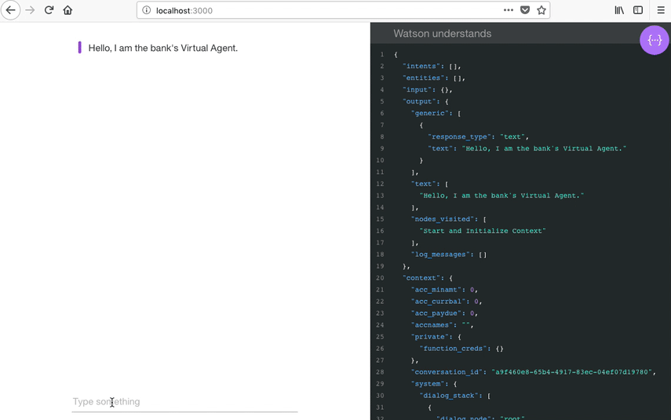
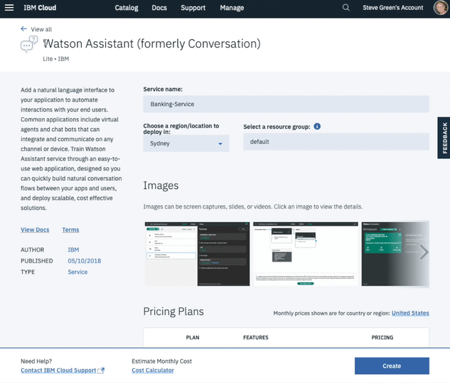

<h1 align="center" style="border-bottom: none;">🚀 Watson Assistant (formerly Conversation) Sample Application</h1>
<h3 align="center">This Node.js app demonstrates the Watson Assistant service in a simple interface engaging in simulated banking tasks, utilising features such as cloud functions and actions.</h3>
<p align="center">
  <a href="http://travis-ci.org/watson-developer-cloud/assistant-intermediate">
    
  </a>
  <a href="#badge">
    
  </a>
</p>
</p>



You can view a [demo][demo_url] of this app.

Please note this app uses the [Watson Assistant V2 API](https://console.bluemix.net/apidocs/assistant-v2#introduction). To access a version of the V1 app, you can go to [v1.1.0](https://github.com/watson-developer-cloud/assistant-intermediate/releases/tag/v1.1.0).

If you need more information about the V1 API, you can go to the [Watson Assistant V1 API page](https://cloud.ibm.com/apidocs/assistant#introduction).


## Prerequisites

1. Sign up for an [IBM Cloud account](https://console.bluemix.net/registration/).
1. Download the [IBM Cloud CLI](https://console.bluemix.net/docs/cli/index.html#overview).
1. Create an instance of the Watson Assistant service and get your credentials:
    - Go to the [Watson Assistant](https://console.bluemix.net/catalog/services/conversation) page in the IBM Cloud Catalog.
    - Log in to your IBM Cloud account.
    - Click **Create**.
    - Click **Show** to view the service credentials.
    - Copy the `apikey` value.
    - Copy the `url` value.

## Configuring the application

1. In your IBM Cloud console, open the Watson Assistant service instance

2. Click the **Import workspace** icon in the Watson Assistant service tool. Specify the location of the workspace JSON file in your local copy of the app project:

    `<project_root>/training/banking_workspace.json`

3. Select **Everything (Intents, Entities, and Dialog)** and then click **Import**. The car dashboard workspace is created.

4. Click the menu icon in the upper-right corner of the workspace tile, and then select **View details**.

5. Click the  icon to copy the workspace ID to the clipboard.

    

6. In the application folder, copy the *.env.example* file and create a file called *.env*

    ```
    cp .env.example .env
    ```

7. Open the *.env* file and add the service credentials that you obtained in the previous step. The Watson SDK automaticaly locates the correct enviromental variables for either `username`, `password`, and `url` or the `apikey` and `url` credentials found in the *.env* file.

    Example *.env* file that configures the `apikey` and `url` for a Watson Assistant service instance hosted in the US East region:

    ```
    ASSISTANT_IAM_APIKEY=X4rbi8vwZmKpXfowaS3GAsA7vdy17Qh7km5D6EzKLHL2
    ASSISTANT_URL=https://gateway-wdc.watsonplatform.net/assistant/api
    ```

8. Add the `ASSISTANT_ID` to the previous properties

    ```
    ASSISTANT_ID=522be-7b41-ab44-dec3-g1eab2ha73c6
    ```

## Running locally

1. Install the dependencies

    ```
    npm install
    ```

1. Run the application

    ```
    npm start
    ```

1. View the application in a browser at `localhost:3000`

## Deploying to IBM Cloud as a Cloud Foundry Application

1. Login to IBM Cloud with the [IBM Cloud CLI](https://console.bluemix.net/docs/cli/index.html#overview)

    ```
    ibmcloud login
    ```

1. Target a Cloud Foundry organization and space.

    ```
    ibmcloud target --cf
    ```

1. Edit the *manifest.yml* file. Change the **name** field to something unique.  
  For example, `- name: my-app-name`.
1. Deploy the application

    ```
    ibmcloud app push
    ```

1. View the application online at the app URL.  
For example: https://my-app-name.mybluemix.net


## License

This sample code is licensed under Apache 2.0.  
Full license text is available in [LICENSE](LICENSE).

## Contributing

See [CONTRIBUTING](CONTRIBUTING.md).

## Open Source @ IBM

Find more open source projects on the
[IBM Github Page](http://ibm.github.io/).


[demo_url]: https://assistant-intermediate.ng.bluemix.net/
[doc_intents]: (https://cloud.ibm.com/docs/services/conversation/intents-entities.html#planning-your-entities)
[docs]: https://cloud.ibm.com/docs/services/assistant?topic=assistant-index
[docs_landing]: (https://cloud.ibm.com/docs/services/assistant?topic=assistant-index)
[node_link]: (http://nodejs.org/)
[npm_link]: (https://www.npmjs.com/)
[sign_up]: cloud.ibm.com/registration
